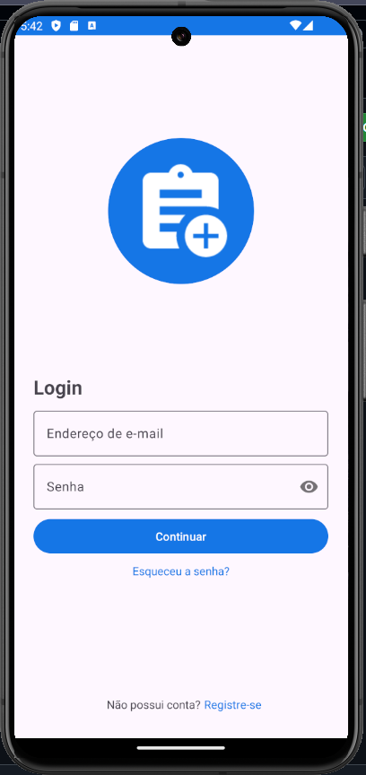
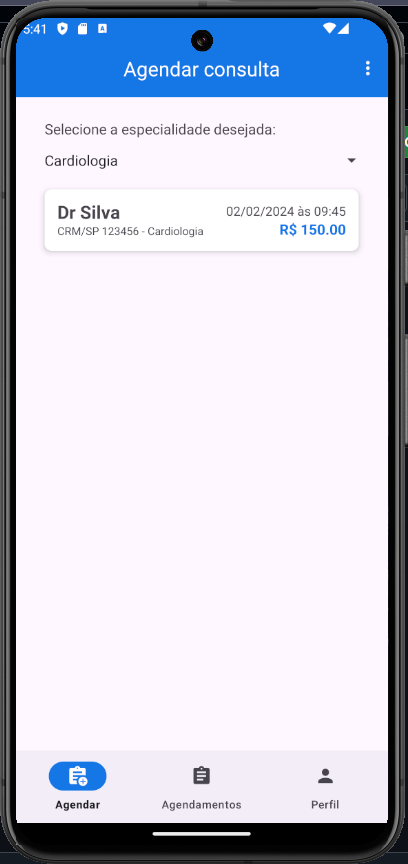
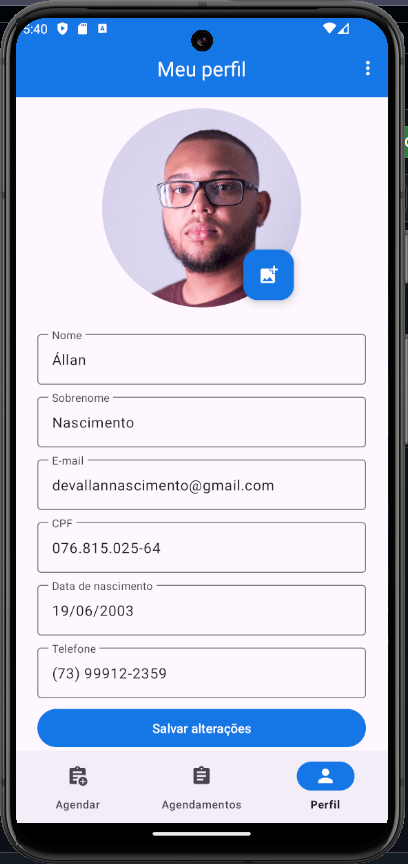

# AgendaBem

Este projeto é um aplicativo Android desenvolvido em Kotlin no Android Studio, utilizando Firebase para autenticação, armazenamento de dados e notificações push. As bibliotecas [Maskara](https://github.com/santalu/maskara) e [Glide](https://bumptech.github.io/glide/) são utilizadas para máscara de EditText e carregamento de imagens, respectivamente.

| Login        | Agendar   | Perfil    |
| ------------- | ------------- | ------------- |
|   |  |   |

### Recursos Principais

- **Autenticação e Recuperação de Senha**
  - Firebase Authentication.
  - Recuperação de senha por e-mail.

- **Armazenamento de Dados**
  - Firestore para dados do aplicativo.
  - Firebase Storage para fotos dos usuários.

- **Notificações**
  - Cloud Messaging para notificações push.

- **Permissões**
  - Controle de permissões para acesso a armazenamento interno e notificações.

## Estrutura do Projeto

O projeto está estruturado em diferentes partes:

1. **Activity de Login**
   - Autenticação via e-mail e senha.
   - Recuperação de senha por e-mail.

2. **MainActivity**
   - Contém uma Toolbar.
   - Utiliza um FragmentContainerView para navegar entre Fragments com uma BottomNavigationBar.

3. **Activity de Cadastro de Usuário**
   - Cadastro de novos usuários, salvando dados no Firestore.

4. **Fragments**
   - **Agendar Fragment:**
     - Agendamento de consultas com Spinner e RecyclerView.
   - **Agendamentos Fragment:**
     - Visualização e cancelamento de consultas marcadas no RecyclerView.
   - **Perfil Fragment:**
     - Exibição e atualização dos dados do usuário no Firestore.

5. **Componentes Específicos**

   - **Adapter para RecyclerView:**
     - Personalizado para exibir dados de consultas ou agendamentos.

   - **Modelo de Usuário:**
     - Representa os dados do usuário.

   - **Modelo de Consulta:**
     - Representa os dados de uma consulta agendada.

6. **Bibliotecas Utilizadas**

   - **Maskara:**
     - [GitHub - Maskara](https://github.com/santalu/maskara)
     - Utilizada para formatação de campos de texto (EditText).

   - **Glide:**
     - [Glide Documentation](https://bumptech.github.io/glide/)
     - Utilizada para carregamento eficiente de imagens, especialmente para fotos de usuários.

## Pré-requisitos

Certifique-se de ter o [Android Studio](https://developer.android.com/studio) instalado no seu ambiente de desenvolvimento.

## Executando o Projeto

1. Clone o repositório para o seu ambiente local.
2. Abra o projeto no Android Studio.
3. Execute o aplicativo em um emulador ou dispositivo Android.

## License

```
   Copyright 2024 Nascimento Santos

   Licensed under the Apache License, Version 2.0 (the "License");
   you may not use this file except in compliance with the License.
   You may obtain a copy of the License at

       http://www.apache.org/licenses/LICENSE-2.0

   Unless required by applicable law or agreed to in writing, software
   distributed under the License is distributed on an "AS IS" BASIS,
   WITHOUT WARRANTIES OR CONDITIONS OF ANY KIND, either express or implied.
   See the License for the specific language governing permissions and
   limitations under the License.
```
